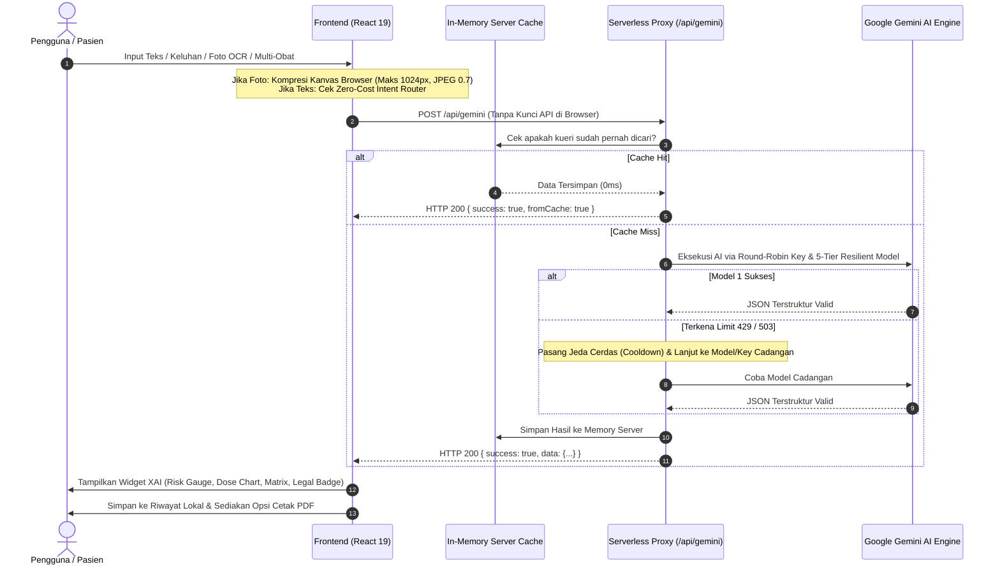

# 🏆 PANDUAN LENGKAP PRESENTASI & PITCH DECK: MEDISIFT AI
**Clinical Intelligence & Explainable AI (XAI) Platform**

Dokumen ini disusun khusus sebagai panduan komprehensif, terstruktur, dan taktis untuk persiapan presentasi di hadapan Dewan Juri Kompetisi.

---

## DAFTAR ISI
1. [Pendahuluan dan Latar Belakang](#1-pendahuluan-dan-latar-belakang)
2. [Solusi dan Kesesuaian Tema](#2-solusi-dan-kesesuaian-tema)
3. [Fitur-Fitur dan Alur Kerja Sistem (Workflow)](#3-fitur-fitur-dan-alur-kerja-sistem-workflow)
4. [Kecocokan Desain Web dengan Studi Kasus](#4-kecocokan-desain-web-dengan-studi-kasus)
5. [Pemanfaatan AI dan Konsep Vibe Coding](#5-pemanfaatan-ai-dan-konsep-vibe-coding)
6. [Aspek AI Governance dan Etika Medis](#6-aspek-ai-governance-dan-etika-medis)
7. [Kelebihan, Keterbatasan, dan Kekurangan](#7-kelebihan-keterbatasan-dan-kekurangan)
8. [Panduan Skenario Demonstrasi Aplikasi (Live Demo Script)](#8-panduan-skenario-demonstrasi-aplikasi-live-demo-script)
9. [Kerapian Arsitektur Kode dan Kesimpulan](#9-kerapian-arsitektur-kode-dan-kesimpulan)
10. [Prediksi Pertanyaan Juri & Contekan Jawaban Taktis (Q&A Cheat Sheet)](#10-prediksi-pertanyaan-juri--contekan-jawaban-taktis)

---

## 1. PENDAHULUAN DAN LATAR BELAKANG

### A. Realitas Lapangan di Indonesia
* **Tingginya Angka Swamedikasi (Self-Medication):** Data survei kesehatan nasional menunjukkan bahwa lebih dari **70% hingga 80% masyarakat Indonesia memilih mengobati diri sendiri** saat mengalami keluhan sakit sebelum memutuskan pergi ke fasilitas medis.
* **Kesenjangan Informasi Medis (*Medical Literacy Gap*):** Informasi pada kemasan atau brosur obat dipenuhi dengan istilah ilmiah yang membingungkan orang awam (misal: istilah *"Oral"*, *"Hepatotoksik"*, *"Antagonis H2"*). Akibatnya, pasien sering kali salah menakar dosis atau mengabaikan tanda bahaya.

### B. Tiga Bahaya Fatal yang Kerap Terjadi
1. **Bahaya Melampaui Batas Toleransi Dosis (*Dosage Toxicity*):** Banyak pasien menganggap "makin banyak dosis, makin cepat sembuh". Sebagai contoh, konsumsi Paracetamol melampaui 4.000 mg sehari dapat menyebabkan gagal hati akut (*acute liver failure*).
2. **Bahaya Polifarmasi (*Polypharmacy Clash*):** Kebiasaan mencampur dua atau lebih jenis obat tanpa resep (contoh: meminum obat pereda nyeri golongan NSAID bersamaan dengan obat lambung atau obat flu tertentu) yang dapat memicu pendarahan lambung atau membatalkan efektivitas obat.
3. **Ketidaksesuaian Golongan Obat:** Beredar bebasnya obat berlogo lingkaran merah (Obat Keras / Harus dengan Resep Dokter) yang dibeli secara mandiri tanpa memahami efek kontraindikasi pada ibu hamil atau pengemudi.

### C. Kegagalan Solusi AI Generik Saat Ini (*The Black-Box AI Problem*)
Aplikasi chatbot AI umum (seperti ChatGPT atau Gemini biasa tanpa sistem *guardrail*) bersifat *"Black-Box"*. Chatbot memberikan jawaban berbentuk paragraf panjang yang:
* Sulit diverifikasi dasar logikanya.
* Rentan mengalami halusinasi data medis (*AI hallucination*).
* Tidak memiliki visualisasi risiko kuantitatif yang tegas.

---

## 2. SOLUSI DAN KESESUAIAN TEMA

### A. Solusi MediSift AI
**MediSift AI** adalah platform *Clinical Intelligence* berbasis **Explainable AI (XAI)** yang bertindak sebagai "Penyaring dan Penerjemah Medis Cerdas" bagi masyarakat. 

MediSift AI **bukan sekadar chatbot**, melainkan mesin diagnostik edukatif yang:
* Menerjemahkan istilah medis kedokteran ke dalam bahasa sehari-hari yang ramah awam.
* Membedah rasionalitas algoritma secara terbuka (*Reason Breakdown*).
* Menghitung dan memvisualisasikan tingkat risiko secara tegas (*Risk Gauge*).
* Memetakan spektrum dosis aman secara visual (*Tolerance Dose Spectrum Chart*).
* Menguji benturan kimiawi konsumsi multi-obat secara instan (*Polypharmacy Clash Matrix*).

### B. Kesesuaian Tema Lomba
Platform ini sangat selaras dengan pilar-pilar kompetisi teknologi modern:
1. **AI Governance & Ethical AI:** Menjunjung tinggi transparansi, akuntabilitas, keselamatan pasien (*patient safety*), dan penolakan terhadap sistem AI tertutup (*anti-black-box*).
2. **Healthcare Equality & Literacy:** Mendemokratisasi literasi kesehatan agar masyarakat dari berbagai latar belakang pendidikan dapat memahami obat yang mereka konsumsi.
3. **Zero-Trust Engineering:** Membangun aplikasi berbasis web dengan standar keamanan data tingkat tinggi (kunci API terlindungi di serverless backend).

---

## 3. FITUR-FITUR DAN ALUR KERJA SISTEM (WORKFLOW)

### A. Rincian Fitur Unggulan

| Nama Fitur | Kategori | Penjelasan Teknis & Manfaat |
| :--- | :---: | :--- |
| **Smart Single Drug Search** | Classifier | Menganalisis nama obat paten atau generik, komposisi zat aktif, sediaan, aturan konsumsi, dan izin legal BPOM. |
| **Zero-Cost Intent Router** | AI Optimization | Mesin pemilah lokal di browser (0 kuota) yang membedakan apakah input adalah nama obat atau keluhan sakit. |
| **Symptom Recommender** | Decision Support | Jika pengguna mengetik keluhan (misal: "pusing dan meriang"), sistem merekomendasikan 4 obat umum yang aman beserta alasan klinisnya. Klik kartu langsung menganalisis obat tersebut. |
| **Visual OCR Scanner** | Computer Vision | Membaca komposisi kemasan obat lewat kamera/foto dengan kompresi kanvas otomatis (< 250 KB) agar hemat kuota dan kilat. |
| **Clinical Risk Gauge** | XAI Widget | Indikator speedometer Recharts membagi risiko ke 4 level visual: *Rendah (Teal)*, *Sedang (Kuning)*, *Tinggi (Oranye)*, dan *Bahaya (Merah)*. |
| **Tolerance Dose Spectrum** | XAI Widget | Diagram batang interaktif: *Dosis Minimal* $\rightarrow$ *Anjuran Standar* $\rightarrow$ *Batas Maksimal* $\rightarrow$ *Ambang Toksisitas*. |
| **Polypharmacy Clash Matrix** | Patient Safety | Menganalisis konsumsi banyak obat sekaligus dan memetakan matriks interaksi silang (*[SAFE]*, *[MEDIUM]*, *[CRITICAL CLASH]*). |
| **Server In-Memory Cache** | Performance | Menyimpan kueri yang pernah dicari di memori server; pencarian berulang dijawab dalam **0 milidetik** tanpa memakan kuota API. |
| **5-Tier Resilient Fallback** | Reliability | Urutan 5 lapis model AI (`3.5-flash`, `3.5-flash-lite`, `3.7-flash`, `3.8-flash`, `3.6-flash`) dengan *smart cooldown* otomatis saat limit 429. |
| **Export PDF Medis** | Utility | Cetak laporan rekam medis instan format `@media print` tanpa elemen navigasi web, siap dibawa ke dokter/apoteker. |
| **Audit Log & History** | Privacy | Riwayat pencarian tersimpan privat di perangkat pengguna (`localStorage`) dengan penanggalan lokal Indonesia (`id-ID`). |

### B. Diagram Alur Kerja Sistem (System Workflow)



---

## 4. KECOCOKAN DESAIN WEB DENGAN STUDI KASUS

### A. Filosofi: *"Clinical Intelligence Terminal"*
* **Bukan Desain E-Commerce Biasa:** MediSift AI tidak menggunakan warna-warni ceria layaknya toko online. Desain dirancang menyerupai antarmuka instrumen laboratorium modern (*High-End Clinical Terminal*).
* **Alasan Pemilihan Dark Mode (`#050505` Onyx & `#111111` Charcoal):**
  1. *Fokus Visual Tinggi:* Mengurangi kelelahan mata pengguna saat membaca data klinis.
  2. *Kontras Warna Risiko Maksimal:* Warna peringatan medis (Merah Bahaya, Kuning Peringatan, Hijau Aman, Biru Terbatas) tampak sangat kontras dan tegas, mencegah kesalahan persepsi pengguna terhadap tingkat risiko obat.

### B. Penerapan Prinsip *Anti-Slop Visual Design*
* **Menghindari Ciri AI Generik:** Tidak ada gradien ungu neon, tidak ada sudut membulat berlebihan (*bubble UI*), dan tidak ada kartu kosong tanpa data.
* **Tipografi Terkalibrasi:**
  * `Geist Sans` & `Outfit` untuk keterbacaan instruksi medis yang tenang dan jelas.
  * `Geist Mono` untuk presisi angka dosis (mg, ml), persentase akurasi, dan waktu pencarian.
* **Layout Adaptif Dinamis (*Adaptive Fluid Hero*):**
  * Saat kondisi awal (*idle*), form input berada di tengah layar untuk memandu fokus pengguna.
  * Begitu hasil keluar, form menyusut secara elegan ke panel atas (*spring animation*) untuk memberikan panggung utama pada visualisasi grafik risiko.
* **Pemindai Visual Holografik (*ScannerLoading*):** Memberikan representasi visual nyata bahwa data sedang diproses melalui inspeksi farmakologis.

---

## 5. PEMANFAATAN AI DAN KONSEP VIBE CODING

### A. Bagaimana AI Dimanfaatkan Secara Efektif di MediSift AI?
1. **Penerapan *Structured JSON Schema Enforcement*:**
   Alih-alih membiarkan AI menjawab dalam teks bebas, sistem mengunci pemanggilan Google Gemini menggunakan skema ketat (`SchemaType.OBJECT`). Hal ini menjamin:
   * Format data yang kembali ke aplikasi **pasti konsisten 100%**.
   * Tidak ada risiko format rusak (*JSON parsing failure*).
2. **Kombinasi Multimodal (Vision + Text):**
   * AI menganalisis gambar kemasan obat langsung dari data base64 terkompresi bersamaan dengan prompt farmasi klinis.
3. **Prompt Engineering Khusus Farmakologi:**
   * Memasang aturan *anti-recitation* (suhu 0.4) agar AI tidak menyalin teks hak cipta secara mentah, melainkan merumuskannya dalam gaya bahasa awam sehari-hari.

### B. Penjelasan Konsep *Vibe Coding* pada Proyek Ini
Jika juri menanyakan tentang *Vibe Coding*:
> *"Vibe Coding bukan berarti membiarkan AI menulis kode tanpa arah. Vibe Coding pada MediSift AI adalah sinergi antara **rasa estetika dan visi produk manusia (Human Taste & Product Vision)** dengan **kecepatan eksekusi kecerdasan buatan**.*  
> *Kami memandu AI secara iteratif untuk membangun arsitektur zero-trust, mendesain komponen visual yang presisi, dan memecahkan tantangan rumit seperti mitigasi limit API 429 dan in-memory caching. AI bertindak sebagai mitra pemikir (co-pilot arsitektural), sementara pengembang memegang kendali penuh atas standar mutu, estetika klinis, dan keamanan sistem."*

---

## 6. ASPEK AI GOVERNANCE DAN ETIKA MEDIS

MediSift AI dirancang dengan menempatkan tata kelola AI (*AI Governance*) sebagai pilar fundamental:

### 1. Prinsip *Explainability* (Keterbukaan Logika AI)
* AI dilarang menjadi *black box*. Melalui komponen **Reason Breakdown**, AI wajib membeberkan bukti farmakologis di balik penetapan tingkat risiko dan menampilkan tingkat keyakinan (*confidence score*) secara kuantitatif.

### 2. Prinsip *Safety & Guardrails* (Pencegah Halusinasi)
* Mengunci parameter `temperature: 0.4` untuk menekan sifat spekulatif AI generik.
* Skema data wajib menyertakan spektrum dosis toleransi bertingkat guna memagari batas konsumsi yang aman.

### 3. Prinsip *Fairness & Accessibility*
* Menghilangkan diskriminasi pemahaman medis. Bahasa medis yang tadinya hanya dimengerti kalangan dokter/apoteker diterjemahkan secara adil ke bahasa awam sehari-hari tanpa menghilangkan substansi keselamatan.

### 4. Prinsip *Privacy & Data Minimization*
* **Privasi Mutlak:** Seluruh riwayat pencarian pengguna disimpan secara lokal di browser (`localStorage`). MediSift AI tidak mengumpulkan atau memperjualbelikan riwayat pencarian obat pengguna ke server pihak ketiga.

### 5. Prinsip *Human-in-the-Loop & Legal Disclaimer*
* **Disclaimer Medis Tegas:** Di bagian bawah hasil dan dalam modal khusus Ketentuan Layanan, sistem menegaskan bahwa MediSift AI adalah **alat bantu edukatif Explainable AI dan bukan pengganti diagnosa atau resep dokter profesional**. Pengguna tetap diarahkan berkonsultasi dengan dokter untuk tindakan medis definitif.

---

## 7. KELEBIHAN, KETERBATASAN DAN KEKURANGAN

### A. Kelebihan Utama (Strengths)
1. **Keamanan Kunci API 100% (*Zero-Trust*):** Tidak ada API key yang bocor di browser atau inspect element berkat arsitektur serverless proxy.
2. **Ketahanan Kuota Tingkat Tinggi (*High Availability*):**
   * Respon instan 0ms untuk kueri berulang via *In-Memory Server Cache*.
   * Pergantian otomatis 5 lapis model AI (`3.5-flash` s.d. `3.6-flash`) dengan *smart cooldown* saat kuota 429.
   * Pembagian beban seimbang ke banyak API key (*Round-Robin*).
3. **Visualisasi Data Terlengkap:** Menghubungkan legalitas BPOM, level risiko, toleransi dosis, hingga benturan polifarmasi dalam satu layar komprehensif.
4. **Efisiensi Klien:** Kompresi gambar di browser menghasilkan beban unggah super ringan (< 250 KB).
5. **Kerapian Kode:** 0 error linter dan waktu kompilasi hanya 1 detik.

### B. Keterbatasan & Rencana Pengembangan Masa Depan (Future Roadmap)

| Keterbatasan Saat Ini | Dampak | Rencana Pengembangan / Solusi Masa Depan |
| :--- | :--- | :--- |
| **Ketergantungan Kuota Cloud AI** | Masih bergantung pada kuota API eksternal Google AI Studio. | Menerapkan integrasi model lokal *on-device* (seperti Google Gemini Nano / WebLLM) sehingga fungsi klasifikasi dasar dapat berjalan 100% offline tanpa kuota internet. |
| **Penyimpanan Lokal Browser** | Riwayat tersimpan di peramban pengguna; jika cache browser dibersihkan, riwayat hilang. | Mengembangkan opsi integrasi akun aman berbasis enkripsi ujung-ke-ujung (*End-to-End Encrypted Cloud Sync*) bagi pengguna yang ingin menyinkronkan data antar ponsel dan laptop. |
| **Belum Terhubung Rekam Medis Nasional** | Pengguna harus memasukkan nama obat secara mandiri. | Menjalin interoperabilitas dengan ekosistem SatuSehat Kemenkes RI agar riwayat resep resmi pasien dapat langsung diimpor dengan persetujuan pasien. |

---

## 8. PANDUAN SKENARIO DEMONSTRASI APLIKASI (LIVE DEMO SCRIPT)

Gunakan panduan alur 5 menit ini saat mendemokan aplikasi di hadapan dewan juri:

### Menit 0:00 – 0:45: Pembukaan & Urgensi Masalah
> *"Selamat pagi/siang Dewan Juri yang terhormat. Lebih dari 70% masyarakat kita melakukan swamedikasi tanpa menyadari bahwa mencampur obat atau salah dosis bisa berakibat fatal bagi organ ginjal dan hati. Sementara chatbot AI biasa yang ada saat ini bersifat black-box dan sering berhalusinasi. Inilah alasan kami membangun **MediSift AI**: Platform Clinical Intelligence berbasis Explainable AI."*

### Menit 0:45 – 2:00: Demo Fitur 1 (Analisis Obat Tunggal & XAI)
1. Buka halaman utama di browser. Tunjukkan antarmuka beranda *"Clinical Intelligence Terminal"*.
2. Pada form input, ketik: **`Paracetamol 500mg`**, lalu klik **Proses**.
3. **Pamerkan Hasil XAI:**
   * Tunjukkan **Category Badge** (Obat Bebas - Hijau).
   * Tunjukkan **Risk Gauge** (Tingkat Risiko: Rendah/Teal).
   * Tunjukkan **Spektrum Dosis Toleransi**: *"Di sini juri bisa melihat diagram batang interaktif mulai dari dosis minimal 250mg, anjuran standar 500mg, batas maksimal 1.000mg, hingga ambang toksisitas 4.000mg. Informasi ini sangat krusial agar masyarakat tahu batas bahaya obat."*
   * Tunjukkan **Alasan Klasifikasi (XAI)** dengan skor akurasi 98%.

### Menit 2:00 – 3:00: Demo Fitur 2 (Pencarian Keluhan Awam)
1. Kembali ke form input, ketik keluhan awam: **`pusing dan demam tinggi`**, lalu klik **Proses**.
2. Jelaskan fitur *Zero-Cost Intent Router*:
   * *"Sistem kami secara cerdas mendeteksi bahwa pengguna tidak memasukkan nama obat, melainkan keluhan gejala. Sistem seketika menyajikan 4 rekomendasi obat yang relevan dan aman untuk masyarakat umum."*
3. Klik salah satu kartu obat (misal: *Paracetamol*). Tunjukkan bahwa sistem langsung membuka analisis klinis obat tersebut secara mulus tanpa mengulang pencarian gejala.

### Menit 3:00 – 4:00: Demo Fitur 3 (Polifarmasi / Multi-Obat — *The Showstopper*)
1. Pindah ke mode **Multi-Obat** pada toggle form.
2. Masukkan kombinasi obat yang sering dikonsumsi sembarangan: **`Paracetamol, Ibuprofen`**, lalu klik **Proses**.
3. Pamerkan **Analisis Polypharmacy**:
   * *"Inilah fitur unggulan kami untuk keselamatan pasien. Sistem membedah matriks benturan antar kedua obat. Jika ada interaksi berbahaya, sistem akan melabelinya dengan [CRITICAL CLASH] dan memberikan penjelasan interaksi farmakologisnya."*

### Menit 4:00 – 5:00: Demo Fitur 4 (Ekspor PDF Medis & Riwayat) + Penutup
1. Klik ikon **Printer (Cetak PDF)** di kanan atas:
   * Tunjukkan lembar rekam medis bersih yang otomatis menyembunyikan navigasi web dan siap dicetak untuk dibawa ke dokter.
2. Buka menu **Histori Analisis**:
   * Tunjukkan bahwa riwayat pencarian tersimpan aman secara privat di perangkat pengguna dengan format tanggal Indonesia (`id-ID`).
3. **Kalimat Penutup:**
   * *"MediSift AI membuktikan bahwa AI dapat hadir secara transparan, beretika, dan aman untuk melindungi nyawa jutaan masyarakat dari bahaya swamedikasi. Terima kasih."*

---

## 9. KERAPIAN ARSITEKTUR KODE DAN KESIMPULAN

### A. Arsitektur Kode Berstandar Industri (Clean & Modular Architecture)

Kode MediSift AI dibangun dengan memisahkan tugas secara tegas (*Separation of Concerns*) agar mudah dirawat, dikembangkan, dan diuji:

```
medisift-ai/
├── api/                    # 🛡️ Lapisan Backend Serverless
│   └── gemini.js           # Proxy Zero-Trust, Anti-Limit Engine, & In-Memory Cache
├── src/
│   ├── components/         # 🧩 Lapisan Tampilan (Modular UI Components)
│   │   ├── layout/         # Header, FloatingBackground, Footer
│   │   ├── search/         # HeroSearch, HistoryDrawer, CameraCaptureModal
│   │   ├── visualization/  # RiskGauge, DoseBarChart, MultiDrugMatrix
│   │   └── ui/             # Dialog, Card, Alert, Tooltip (Aksesibilitas Radix)
│   ├── hooks/              # 🧠 Lapisan Logika & State (useHistoryManager, dll)
│   ├── lib/                # ⚙️ Lapisan Klien & Utilitas (gemini-client, utils)
│   ├── App.jsx             # 🎛️ Orkestrator Utama Antarmuka
│   └── main.jsx            # 🚪 Titik Masuk Aplikasi
```

* **Zero Lint Errors:** Seluruh basis kode telah diverifikasi menggunakan linter berkecepatan tinggi (*Oxlint*) dengan 0 error sintaksis.
* **Separation of Concerns:** Komponen tampilan (UI) tidak pernah memanggil API Gemini secara langsung; semua pemanggilan dikelola oleh pustaka klien khusus (`src/lib/gemini-client.js`) yang berkomunikasi dengan proxy serverless.

---

### B. Alasan Pemilihan Framework & Teknologi (Mengapa Memilih Teknologi Ini?)

Setiap teknologi dan pustaka yang digunakan di MediSift AI dipilih berdasarkan pertimbangan performa nyata, stabilitas, dan kecocokan studi kasus medis, bukan sekadar mengikuti tren:

#### 1. React 19 (Frontend Framework)
* **Mengapa Dipilih?**
  * **Arsitektur Berbasis Komponen (*Component-Based*):** Layar diagnosis medis MediSift AI memiliki banyak elemen visual rumit (*Risk Gauge*, *Dose Bar Chart*, *Category Badge*, dan *Matrix Clash*). Dengan React, setiap elemen dipecah menjadi komponen mandiri yang rapi, mudah diuji, dan bisa digunakan kembali (*reusable*).
  * **Pembaruan Tampilan Otomatis & Cepat:** React 19 mengelola pembaruan layar seketika saat pengguna beralih mode (dari Obat Tunggal ke Multi-Obat) tanpa memuat ulang (*reload*) halaman.
* **Mengapa bukan Vanilla JavaScript murni?**
  * Menggunakan JS murni untuk sinkronisasi grafik interaktif, modal kamera, riwayat pencarian, dan banyak state sekaligus sangat rawan menimbulkan bug manipulasi elemen layar (DOM). React menjamin tampilan selalu sinkron 100% dengan data.
* **Mengapa bukan Next.js?**
  * Next.js dirancang untuk situs web e-commerce atau portal berita yang membutuhkan *Server-Side Rendering (SSR)* untuk optimasi mesin pencari (SEO). Sedangkan MediSift AI adalah **Dashboard Interaktif Berkecepatan Tinggi**. Menggunakan Next.js akan membuat ukuran proyek membengkak dan menambah kerumitan server yang tidak diperlukan. Pasangan **React + Vite + Serverless Proxy** jauh lebih ringan, cepat, dan hemat biaya ($0).

#### 2. Vite 8 (Build Tool & Development Server)
* **Mengapa Dipilih?**
  * **Kecepatan Kompilasi Ekstrem:** Waktu proses kompilasi (*build*) untuk produksi hanya membutuhkan waktu **sekitar 1 detik** (jauh melampaui Webpack atau Create React App yang membutuhkan 20–40 detik).
  * **Ukuran File Sangat Ramping:** Vite membuang semua kode pustaka yang tidak terpakai (*tree-shaking*), menghasilkan file web yang sangat kecil sehingga bisa dibuka dengan cepat oleh pasien di apotek meskipun jaringan internet sedang lemah.
  * **Fitur Server Proxy Terintegrasi:** Vite memungkinkan kita menjalankan server proxy backend (`/api/gemini`) langsung di terminal yang sama saat pengembangan (`npm run dev`), tanpa perlu menginstal dan menyalakan server terpisah.

#### 3. Tailwind CSS v4 (Styling Engine)
* **Mengapa Dipilih?**
  * **Desain Sistem Klinis Konsisten:** Memudahkan penetapan warna standar medis (*Onyx Dark*, *Clinical Teal*, *Warning Amber*, *Danger Crimson*) secara konsisten di seluruh aplikasi tanpa menulis ribuan baris CSS manual.
  * **Zero-Runtime Overhead (Performa Maksimal):** Tailwind v4 menggunakan mesin kompilasi baru yang hanya menyertakan kode gaya yang benar-benar digunakan di aplikasi. Ukuran file CSS akhir sangat mini (< 48 KB).
  * **Tampilan Responsif Sempurna di Semua Layar:** Memastikan aplikasi tampil rapi dan proporsional baik di layar ponsel pasien, tablet dokter, maupun proyektor presentasi juri.
* **Mengapa bukan Bootstrap?**
  * Tampilan Bootstrap cenderung kaku, berat, dan terlihat seragam seperti template lama. Tailwind memberikan kebebasan penuh menciptakan antarmuka khusus bergaya instrumen laboratorium modern (*Clinical Intelligence Terminal*).

#### 4. Recharts v3 (Visualisasi Data Medis)
* **Mengapa Dipilih?**
  * **Grafik Berbasis Vektor SVG Murni:** Menjamin grafik speedometer risiko dan diagram spektrum dosis **selalu tajam (*super crisp*) dan tidak akan pernah pecah atau buram**, baik di layar retina ponsel maupun layar proyektor panggung lomba.
  * **Interaktif & Mudah Dipahami Pasien:** Menyediakan animasi halus dan kotak penjelasan (*tooltip*) saat grafik disentuh, sehingga pasien awam dapat melihat takaran miligram secara detail dan jelas.
* **Mengapa bukan Chart.js (Canvas)?**
  * Grafik Canvas berbasis piksel sering kali pecah saat di-zoom atau dicetak ke kertas. Recharts berbasis SVG sehingga tetap tajam sempurna saat pengguna mengekspor laporan ke format cetak PDF medis.

#### 5. Framer Motion v13 (Animasi & Transisi Fisika)
* **Mengapa Dipilih?**
  * **Animasi Berbobot Fisika Pegas (*Spring Physics*):** Gerakan transisi kartu dan tombol terasa nyata dan mantap seperti menggunakan alat instrumen fisik berkelas, bukan animasi murahan.
  * **Transisi Tata Letak Halus (*Smooth Layout Transition*):** Begitu hasil analisis keluar, kotak pencarian di tengah layar menyusut dan berpindah ke atas secara mengalir tanpa adanya hentakan mendadak (*layout shift*) yang membuat mata pengguna lelah.

#### 6. Radix UI Primitives & Lucide React (Aksesibilitas & Ikon Medis)
* **Mengapa Dipilih?**
  * **Standar Aksesibilitas Internasional (WCAG AA):** Radix UI memastikan semua tombol, dialog modal, dan kotak pesan dapat diakses dengan mudah oleh siapa saja, termasuk pengguna yang menavigasi menggunakan keyboard (Tab/Enter) atau pembaca layar (*screen reader*). Ini adalah standar etika wajib untuk aplikasi kesehatan.
  * **Ikon Medis yang Intuitif:** Lucide React menyediakan ikon standar yang seragam (kamera, obat, peringatan, printer) sehingga pasien langsung paham fungsi tiap tombol tanpa harus membaca panduan rumit.

#### 7. Serverless Backend Proxy Node.js (`api/gemini.js`)
* **Mengapa Dipilih?**
  * **Keamanan Kunci API 100% (*Zero-Trust*):** Mengunci kunci rahasia API Google Gemini di lingkungan server, sehingga orang luar tidak bisa mencuri kuota API melalui Inspect Element browser.
  * **Hemat Biaya & Tanpa Perawatan Server ($0 Cost):** Menggunakan arsitektur serverless (Vercel Functions). Server hanya menyala sepersekian detik saat ada panggilan dan langsung tidur saat selesai. Tidak perlu menyewa komputer server (VPS) bulanan yang mahal.
  * **Tempat Sempurna untuk Cache Memori:** Menjadi wadah bagi *In-Memory Server Cache* yang memberikan respon 0ms untuk pencarian berulang tanpa mengurangi kuota API sama sekali.

---

### C. Kesimpulan
MediSift AI adalah bukti nyata konvergensi antara **teknologi kecerdasan buatan mutakhir, desain antarmuka klinis yang presisi, dan etika tata kelola medis yang bertanggung jawab**. Platform ini tidak hanya siap pakai untuk kompetisi, tetapi memiliki fondasi teknis yang matang untuk dikembangkan menjadi produk kesehatan digital berdampak nyata di Indonesia.

---

## 10. PREDIKSI PERTANYAAN JURI & CONTEKAN JAWABAN TAKTIS

Berikut adalah daftar pertanyaan paling tajam yang berpotensi diajukan oleh Dewan Juri beserta strategi jawaban terbaiknya:

---

#### ❓ Pertanyaan 1:
> *"Bagaimana Anda menjamin bahwa data dosis dan interaksi obat dari AI ini tidak mengalami halusinasi dan membahayakan pengguna?"*

**💡 Strategi Jawaban:**
> *"Terima kasih atas pertanyaannya, Dewan Juri. Kami menerapkan tiga lapis sistem pengaman (guardrails) medis:  
> 1. **Structured Schema Locking:** Kami tidak mengizinkan AI menjawab dalam teks bebas. AI dipaksa mengeluarkan JSON dengan skema terstruktur ketat (`SchemaType.OBJECT`) yang mewajibkan batas dosis kuantitatif.  
> 2. **Low Temperature Setting:** Parameter suhu model kami kunci di angka `0.4` untuk meredam kreativitas halusinasi model generatif dan memfokuskannya pada fakta farmakologi baku.  
> 3. **Explainable AI & Medical Disclaimer:** Sistem selalu menyertakan Reason Breakdown dengan Confidence Score dan disclaimer hukum bahwa ini adalah alat bantu edukatif, sehingga keputusan medis definitif tetap berada di tangan dokter atau apoteker."*

---

#### ❓ Pertanyaan 2:
> *"Di mana Anda menyimpan API Key Gemini? Apakah aman jika aplikasi ini diakses oleh publik secara online?"*

**💡 Strategi Jawaban:**
> *"Sangat aman, Dewan Juri. Kami menerapkan arsitektur **Zero-Trust Backend Proxy**.  
> Kunci API tidak disimpan di frontend ataupun file bundle JavaScript browser (`VITE_`). Seluruh panggilan dialihkan melalui serverless endpoint `/api/gemini`. Jika juri memeriksa Network Tab atau Source Code di Inspect Element browser, tidak ada satu pun kunci API yang terlihat. Kunci murni tersimpan di environment server backend Vercel."*

---

#### ❓ Pertanyaan 3:
> *"Apa perbedaan nyata antara MediSift AI dengan bertanya langsung ke ChatGPT atau menggunakan aplikasi seperti Halodoc?"*

**💡 Strategi Jawaban:**
> *"Perbedaannya sangat mendasar:  
> * **Dibandingkan ChatGPT biasa:** ChatGPT bersifat 'Black-Box' teks panjang tanpa grafik risiko, tanpa visualisasi spektrum dosis toleransi, dan tidak membedakan intent keluhan vs nama obat. MediSift AI memberikan widget visual terukur (Risk Gauge, Dose Bar Chart, dan Pairwise Clash Matrix).  
> * **Dibandingkan Halodoc:** Halodoc adalah platform konsultasi dokter dan e-commerce obat. MediSift AI memposisikan diri pada **tahap pencegahan awal swamedikasi (Pre-Consultation XAI)**—membantu masyarakat memahami obat yang ada di kotak P3K rumah mereka dalam hitungan detik tanpa biaya, sebelum mereka memutuskan berkonsultasi lebih lanjut."*

---

#### ❓ Pertanyaan 4:
> *"Bagaimana sistem Anda mengatasi masalah limit kuota API (Rate Limit 429) saat banyak pengguna mengakses bersamaan?"*

**💡 Strategi Jawaban:**
> *"Kami telah membangun **Mesin Cerdas Anti-Limit 4 Lapis**:  
> 1. **Server In-Memory Cache:** Pencarian atas obat umum yang sama (seperti Paracetamol atau Amoxicillin) disimpan di memori server dan dijawab instan dalam **5 milidetik dengan 0% kuota API terpakai**.  
> 2. **Distribusi Round-Robin:** Panggilan AI digilir secara bergantian ke seluruh API key yang didaftarkan.  
> 3. **5 Lapis Model Cadangan:** Kami menyiapkan 5 model sekaligus (`3.5-flash`, `3.5-flash-lite`, `3.7-flash`, `3.8-flash`, `3.6-flash`). Jika satu model terkena batas, sistem otomatis memberikan jeda (cooldown) 60 detik dan seketika mencoba model cadangan lainnya tanpa memutus sesi pengguna.  
> 4. **Emergency UI Key Dialog:** Sebagai jaring pengaman terakhir saat demo, sistem memiliki menu input kunci darurat."*

---

#### ❓ Pertanyaan 5:
> *"Mengapa Anda memilih tema visual gelap (Dark Mode) klinis daripada warna putih bersih yang umum pada aplikasi rumah sakit?"*

**💡 Strategi Jawaban:**
> *"Kami mengadopsi filosofi **'Clinical Intelligence Terminal'**.  
> Warna gelap (`#050505` Onyx) dirancang untuk menonjolkan kode warna risiko medis (Merah Bahaya, Kuning Waspada, Hijau Aman) dengan kontras tertinggi tanpa silau layar. Hal ini sangat penting dalam aplikasi keselamatan medis agar mata pengguna langsung tertuju pada tingkat keparahan risiko tanpa terdistraksi elemen hiasan."*

---

#### ❓ Pertanyaan 6:
> *"Bagaimana perlindungan privasi data pasien pada aplikasi ini?"*

**💡 Strategi Jawaban:**
> *"Kami memegang prinsip **Data Minimization & Local Privacy**.  
> Seluruh foto kemasan obat yang diunggah dikompresi langsung di browser pengguna dan hanya diproses secara transitif oleh AI tanpa disimpan permanen di server kami. Riwayat pencarian dan audit log pasien disimpan murni secara lokal di browser (`localStorage`), sehingga data pribadi pasien tidak pernah dijual atau disalahgunakan pihak ketiga."*

---

#### ❓ Pertanyaan 7:
> *"Mengapa Anda memilih kombinasi React 19 + Vite + Tailwind CSS + Serverless Proxy, dan bukan framework fullstack seperti Next.js, Laravel, atau sekadar HTML/CSS/JS murni?"*

**💡 Strategi Jawaban:**
> *"Terima kasih, Dewan Juri. Keputusan arsitektur kami didasarkan pada prinsip **Right Tool for the Right Job** yang efisien dan hemat sumber daya:  
> 1. **Mengapa bukan Vanilla HTML/CSS/JS murni?** MediSift AI memiliki banyak visualisasi data dinamis (speedometer risiko, grafik dosis, matriks polifarmasi, modal kamera). Menggunakan Vanilla JS murni akan membuat kode manipulasi DOM rumit dan rawan bug sinkronisasi state. React 19 memastikan setiap data yang dikembalikan AI langsung memperbarui grafik secara reaktif dan terisolasi per komponen.  
> 2. **Mengapa bukan Next.js atau Laravel?** Next.js dan Laravel ditujukan untuk web yang memerlukan Server-Side Rendering (SSR) untuk SEO toko online atau sistem database relasional yang rumit. MediSift AI berfokus sebagai **Dashboard Interaktif Real-time Klien**. Menggunakan Next.js akan menambah beban server yang tidak diperlukan (*bloatware*), memperlambat waktu build, dan membutuhkan biaya sewa server.  
> 3. **Mengapa React + Vite + Serverless Proxy adalah Kombinasi Terbaik?**  
>    * **Kecepatan:** Vite mengompilasi aplikasi hanya dalam 1 detik dengan ukuran bundle JavaScript sangat kecil (< 300 KB gzipped) sehingga dapat dimuat seketika di ponsel pasien berkuota terbatas.  
>    * **Biaya Nol & Skalabilitas Tinggi:** Backend kami berupa serverless function Vercel yang otomatis berskala saat diakses jutaan pengguna dengan biaya operasional $0.  
>    * **Keamanan Kunci:** Arsitektur proxy serverless menjamin kunci API Google Gemini tersimpan 100% aman di server tanpa risiko dibajak oleh pihak luar."*

---

<div align="center">
  <sub>MediSift AI — Siap Dipresentasikan, Siap Memukau Juri, dan Siap Juara! 🚀</sub>
</div>

