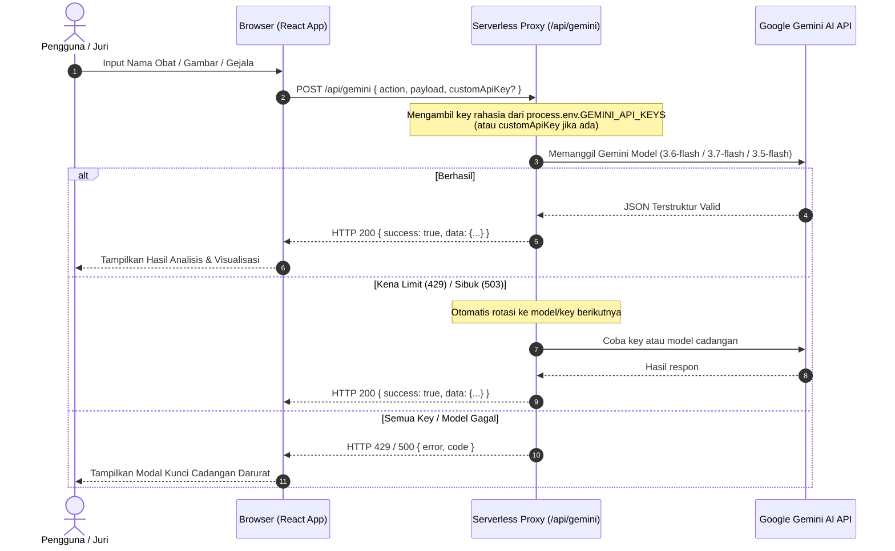

# Spesifikasi Desain: Pengamanan API Key MediSift AI

**Tanggal:** 18 September 2026  
**Topik:** Pengamanan Gemini API Key via Serverless Backend Proxy & Vite Dev Middleware  
**Status:** Disetujui (Approved)

---

## 1. Latar Belakang & Masalah
Sebelumnya, MediSift AI adalah aplikasi murni *Client-Side* (Vite + React). Kunci API (`VITE_GEMINI_API_KEYS`) disuntikkan langsung ke dalam bundle JavaScript di browser. Hal ini menyebabkan risiko keamanan serius:
1. Siapa pun dapat menginspeksi file JavaScript di browser atau melihat *Network Tab* (DevTools) untuk mencuri API Key.
2. Jika kode diunggah ke repository publik atau dideploy langsung, kuota API Key rentan dihabiskan oleh pihak tidak bertanggung jawab.

## 2. Tujuan & Kriteria Keberhasilan
- **Kerahasiaan Kunci:** Kunci API utama disimpan di sisi server (`process.env.GEMINI_API_KEYS`), tidak pernah dikirimkan atau bocor ke browser pengguna.
- **Kenyamanan Lokal & Produksi:**
  - Di Vercel (Produksi): Berjalan otomatis sebagai Serverless Function (`/api/gemini.js`).
  - Di Laptop (Lokal `npm run dev`): Berjalan langsung via middleware Vite tanpa perlu menyalakan dua server terpisah.
- **Resiliensi & Anti-Limit:**
  - Mempertahankan rotasi multi-model (`gemini-3.6-flash` -> `gemini-3.7-flash` -> `gemini-3.5-flash`).
  - Mempertahankan rotasi multi-key jika salah satu key mencapai batas kuota (HTTP 429).
  - Mempertahankan aturan anti-recitation (*anti-plagiarism*) dan skema JSON terstruktur.
- **Opsi Darurat Lomba:** Pengguna/juri tetap dapat memasukkan API Key cadangan secara manual di modal darurat UI jika kuota server habis saat live demo.

---

## 3. Arsitektur & Alur Data



---

## 4. Rincian Komponen

### A. Serverless Function (`/api/gemini.js`)
File ini bertindak sebagai satu pintu masuk backend:
- **Metode:** `POST`
- **Payload Request:**
  ```json
  {
    "action": "ANALYZE" | "SUGGEST" | "POLYPHARMACY",
    "payload": { ... },
    "customApiKey": "opsional_string_kunci_darurat"
  }
  ```
- **Prioritas API Key:**
  1. Jika `customApiKey` dikirimkan (dari input darurat di web), gunakan itu terlebih dahulu.
  2. Jika tidak ada, gunakan `process.env.GEMINI_API_KEYS` (koma-terpisah).
- **Logika Internal:**
  - Mengimpor `@google/generative-ai` di lingkungan Node.js.
  - Memuat skema JSON ketat untuk ketiga jenis aksi (`ANALYZE`, `SUGGEST`, `POLYPHARMACY`).
  - Menjalankan iterasi key dan model fallback jika terjadi 429 atau 503.
- **Respon:**
  - Status 200: `{ "success": true, "data": { ... } }`
  - Status 400/401/429/500: `{ "success": false, "error": "PESAN_ERROR", "code": "KODE_ERROR" }`

### B. Vite Dev Middleware (`vite.config.js`)
Agar saat `npm run dev` di laptop pengembang tidak perlu menjalankan server Node.js terpisah atau Vercel CLI:
- Ditambahkan middleware kustom di konfigurasi `server.middlewares` Vite.
- Middleware ini mencegat setiap request ke `/api/gemini`, membaca body JSON, dan memanggil fungsi handler dari `api/gemini.js`.
- Kunci API lokal dibaca dari file `.env` via `process.env.GEMINI_API_KEYS` (didukung native oleh Node saat menjalankan Vite).

### C. Frontend Client (`src/lib/gemini-client.js`)
- Diubah agar tidak lagi mengimpor `@google/generative-ai` langsung di browser.
- Fungsi `analyzeDrug`, `suggestDrugs`, dan `analyzePolypharmacy` diubah menjadi pemanggil `fetch('/api/gemini', { ... })`.
- Membaca `localStorage.getItem('MEDISIFT_API_KEY')` dan jika ada, dikirimkan sebagai field `customApiKey`.
- Fungsi `determineIntent` tetap berada di frontend karena murni logika aturan teks bebas biaya (*zero cost*).

### D. Konfigurasi Lingkungan (`.env` & `.env.example`)
- Ubah `VITE_GEMINI_API_KEYS` menjadi `GEMINI_API_KEYS`.
- Ini memastikan Vite tidak lagi mengekspos variabel tersebut ke bundle frontend.

---

## 5. Rencana Pengujian & Verifikasi
1. **Verifikasi Build:** Jalankan `npm run build` untuk memastikan tidak ada import client yang rusak dan bundle bersih dari API key.
2. **Uji Coba Lokal (`npm run dev`):**
   - Tes fitur Analisis Obat (teks).
   - Tes fitur Rekomendasi Gejala (keluhan).
   - Tes fitur Polifarmasi (interaksi multi-obat).
   - Tes opsi darurat (input API Key kustom).
3. **Verifikasi Keamanan:** Buka Network Tab di DevTools browser, pastikan hanya ada request ke `/api/gemini` dan tidak ada API key Google yang terlihat di URL, Payload publik, maupun file bundle JS.
