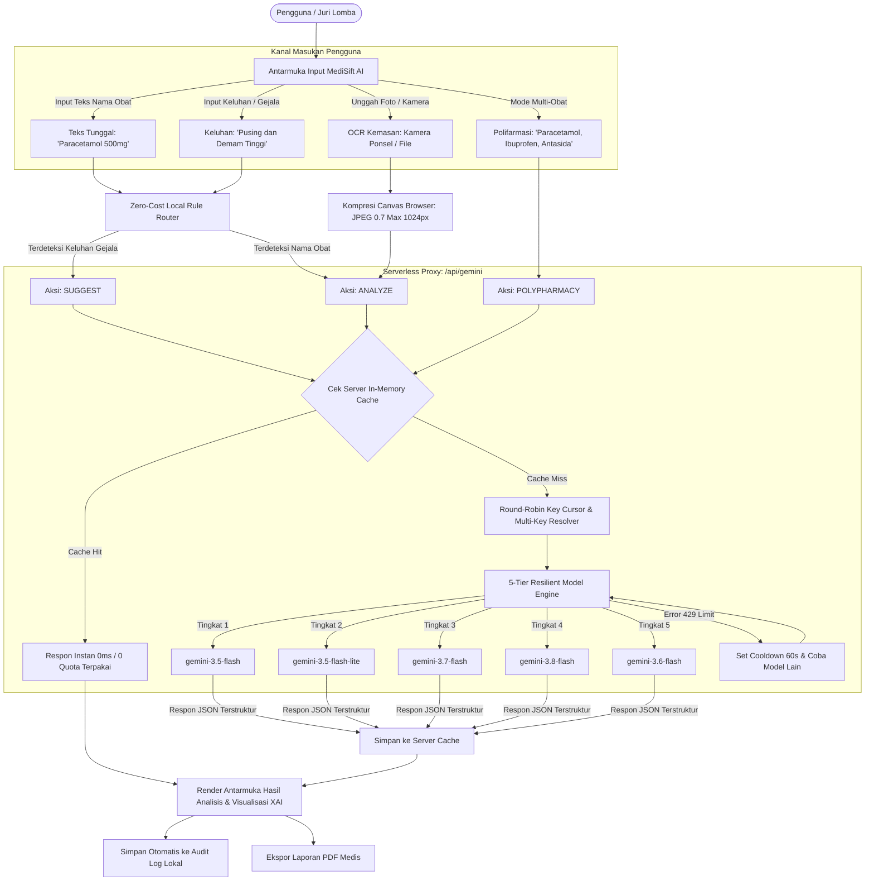

# Product Requirement Document (PRD): MediSift AI

**Nama Produk:** MediSift AI (Clinical Intelligence & Explainable AI Platform)  
**Versi:** 2.0 (Production Ready & Hackathon Verified)  
**Tanggal Rilis:** 18 September 2026  
**Status Implementasi:** 100% Selesai & Terverifikasi  

---

## 1. Latar Belakang & Pernyataan Masalah (Problem Statement)

### A. Urgensi Medis & Swamedikasi
Di Indonesia dan banyak negara berkembang, lebih dari **70% masyarakat melakukan swamedikasi (pengobatan mandiri)** tanpa pengawasan dokter atau apoteker. Permasalahan utama yang kerap terjadi:
1. **Ketidaktahuan Dosis & Efek Samping:** Pengguna awam sering kali mengonsumsi obat di luar batas toleransi aman, memicu ambang toksisitas atau kerusakan organ (ginjal dan hati).
2. **Bahaya Polifarmasi (*Polypharmacy Clash*):** Mengonsumsi dua atau lebih jenis obat secara bersamaan tanpa menyadari bahwa zat aktif di dalamnya dapat saling bertubrukan (*antagonistik*) atau melipatgandakan efek racun (*sinergis toksik*).
3. **Bahasa Medis yang Sulit Dipahami:** Brosur kemasan obat penuh dengan istilah kedokteran yang rumit, membuat pasien salah paham dalam aturan pakai.

### B. Masalah AI Tradisional (*The Black-Box AI Problem*)
Aplikasi chatbot AI generik yang ada saat ini sering kali bersifat *"Black-Box"*—memberikan jawaban tanpa alasan medis yang jelas dan rentan mengalami halusinasi (*AI hallucination*).

### C. Solusi: MediSift AI
**MediSift AI** hadir sebagai platform **Explainable AI (XAI)** medis terpadu. Sistem ini tidak sekadar memberikan jawaban, tetapi membedah rasionalitas klinis (*Reason Breakdown*), memetakan spektrum dosis aman secara visual (*Tolerance Dose Spectrum*), menghitung tingkat risiko (*Clinical Risk Gauge*), dan mendeteksi benturan polifarmasi secara instan menggunakan bahasa awam yang mudah dipahami.

---

## 2. Nilai Unggulan Produk (Unique Value Proposition)

- **Transparansi Penuh (Explainable AI / XAI):** Menampilkan skor keyakinan (*confidence score*), logika klasifikasi, dan rincian interaksi zat kimia secara terbuka.
- **Bahasa Ramah Awam (*Plain-Language Health Communication*):** Seluruh istilah medis diterjemahkan otomatis ke istilah sehari-hari (contoh: *"Diminum"* bukan *"Oral"*, *"Dioles"* bukan *"Topikal"*, *"Obat Bebas"* bukan *"OTC"*).
- **Keamanan Tanpa Celah (*Zero-Trust API Security*):** Kunci API disimpan 100% di serverless backend proxy, tidak pernah terekspos ke browser atau *Inspect Element*.
- **Mesin Anti-Limit 5 Lapis (*5-Tier Resilient AI Engine*):** Dilengkapi *server-side memory caching* (respon 0ms tanpa kuota), pembagian beban *Round-Robin* antar kunci API, dan rotasi otomatis ke 5 model AI tangguh jika terjadi lonjakan trafik.
- **Pindai Kemasan Otomatis (OCR):** Pemindaian teks kemasan obat langsung dari kamera atau berkas dengan kompresi cerdas di browser.
- **Laporan Klinis Siap Cetak (Export to PDF):** Menghasilkan laporan evaluasi obat rapi yang siap dibawa ke dokter atau apoteker.

---

## 3. Alur Pengguna & Arsitektur Sistem (User Flow & Architecture)



---

## 4. Rincian Fitur yang Telah Diimplementasikan

### A. Multi-Input Classifier & Intent Router
1. **Analisis Obat Tunggal (Tunggal Mode):**
   - Mendeteksi nama obat dagang maupun generik, wujud sediaan (tablet, sirup, kapsul), rute pemberian, serta daftar komposisi bahan aktif.
2. **Pencarian Berbasis Keluhan (Symptom-to-Drug Recommender):**
   - *Zero-Cost Intent Router:* Memilah input pengguna secara lokal di browser tanpa biaya API.
   - Jika pengguna mengetik gejala (misal: "batuk berdahak", "meriang"), sistem menyajikan maksimal 4 rekomendasi obat umum yang aman beserta alasan farmakologisnya.
   - **Seamless Drill-Down:** Mengklik kartu rekomendasi obat seketika membuka analisis klinis mendalam untuk obat tersebut tanpa memicu pencarian gejala ulang.
3. **Pindai Kemasan Visual (OCR Visual Scanner):**
   - Membaca teks komposisi pada kemasan obat secara otomatis.
   - Kompresi sisi klien (*client-side canvas compression*) membatasi dimensi gambar maksimal 1024px dengan kualitas 0.7, menghasilkan berkas ringan (< 250 KB) yang terkirim dalam sekejap.

### B. Widget Explainable AI (XAI) & Tata Kelola Risiko
1. **Clinical Risk Gauge:**
   - Setengah lingkaran speedometer presisi (menggunakan Recharts Pie) yang membagi tingkat risiko menjadi 4 zona visual tegas: *Rendah (Clinical Teal)*, *Sedang (Kuning)*, *Tinggi (Oranye)*, dan *Bahaya (Critical Crimson)*.
2. **Tolerable Dose Spectrum (Spektrum Dosis Toleransi):**
   - Diagram batang interaktif bertingkat yang memvisualisasikan:
     - Dosis Minimal
     - Anjuran Standar
     - Batas Maksimal
     - Ambang Toksisitas
3. **Klasifikasi Legalitas BPOM (CategoryBadge):**
   - Badge dengan kode warna standar regulasi kesehatan:
     - *Obat Bebas:* Hijau
     - *Obat Bebas Terbatas:* Biru
     - *Obat Keras:* Merah (dengan peringatan resep dokter)
     - *Suplemen / Herbal:* Kuning
4. **Matriks Interaksi Zat Kimia & Peringatan Harian:**
   - Memperingatkan zat benturan (misal: alkohol, susu, kafein) dan efek buruknya.
   - Peringatan aktivitas harian (contoh: "Menyebabkan Kantuk / Dilarang Mengemudi").
   - Kategori keselamatan kehamilan (Kategori A, B, C, D, X).
5. **Reason Breakdown (Kotak Transparansi AI):**
   - Menyajikan uraian rasional medis di balik hasil klasifikasi lengkap dengan persentase skor keyakinan (*confidence score*).

### C. Pemindai Polifarmasi (Multi-Drug Pairwise Clash Scanner)
1. **Pencarian Banyak Obat Sekaligus:**
   - Pengguna dapat mengetikkan kombinasi obat yang diminum bersamaan (misal: "Paracetamol, Ibuprofen, Antasida").
2. **Matriks Pasangan Silang (*Pairwise Cross-Clash*):**
   - Memetakan setiap pasangan kombinasi obat dan melabelinya dengan status:
     - `[SAFE]`: Aman dikonsumsi bersamaan.
     - `[LOW]` / `[MEDIUM]`: Perlu jeda waktu minum atau pemantauan ringan.
     - `[CRITICAL CLASH]`: Benturan berbahaya yang berisiko merusak organ atau membatalkan efektivitas obat.
3. **Integrasi Riwayat Khusus:**
   - Hasil analisis polifarmasi tersimpan di riwayat dengan badge pembeda `Multi-Obat`.

### D. Sistem Keamanan API & Mesin Anti-Limit (Anti-Quota Exhaustion)
1. **Pintu Belakang Serverless (`/api/gemini`):**
   - Kunci API utama (`GEMINI_API_KEYS`) disimpan murni di server environment (`.env`).
   - Bundle JavaScript frontend bersih 100% dari string API key (terbukti via pemindaian `dist/`).
2. **Dukungan Lokal & Produksi:**
   - *Vite Dev Middleware:* Pengembang cukup menjalankan `npm run dev`, endpoint `/api/gemini` langsung aktif tanpa perlu server tambahan.
   - *Vercel Ready:* Otomatis dikenali sebagai Vercel Serverless Function saat dideploy.
3. **Memori Cerdas di Server (*Server In-Memory Cache*):**
   - Setiap obat atau keluhan yang pernah dicari disimpan di memori RAM server selama 1 jam.
   - Pencarian ulang atas kata kunci yang sama merespons dalam **0 milidetik** tanpa memanggil Google dan **memakai 0% kuota API**.
4. **Distribusi Beban Bergilir (*Round-Robin Key Cursor*):**
   - Membagi rata panggilan AI ke seluruh API Key yang didaftarkan, melipatgandakan batas panggilan per menit (RPM).
5. **Urutan 5 Model Cadangan (*5-Tier Fallback Pool*):**
   $$\text{gemini-3.5-flash} \rightarrow \text{gemini-3.5-flash-lite} \rightarrow \text{gemini-3.7-flash} \rightarrow \text{gemini-3.8-flash} \rightarrow \text{gemini-3.6-flash}$$
   - Model yang stabil dan bebas batas harian diprioritaskan terlebih dahulu.
6. **Penanganan Limit Cerdas (*Smart Cooldown*):**
   - Jika satu model terkena batas kuota (429), model tersebut diistirahatkan 60 detik secara otomatis, dan sistem langsung mencoba model cadangan lainnya pada kunci yang sama.
7. **Opsi Kunci Darurat Lomba (*Emergency UI Key Dialog*):**
   - Jika seluruh kuota server habis saat live demo, pengguna/juri tetap dapat memasukkan kunci cadangan di modal darurat UI.

### E. Riwayat Audit, Ekspor PDF & Kepatuhan Etika
1. **Audit Log & Riwayat Lokal:**
   - Menyimpan hingga 50 riwayat pencarian terakhir secara privat di perangkat pengguna (`localStorage`), lengkap dengan format tanggal lokal Indonesia (`id-ID`).
2. **Ekspor Laporan PDF Medis:**
   - Menggunakan format cetak khusus (`@media print`) yang menghilangkan bilah navigasi dan tombol interaktif, menyajikan lembar rekam medis bersih siap cetak atau simpan PDF.
3. **Modal Regulasi & Disclaimer:**
   - Menegaskan bahwa sistem ini merupakan alat peraga *Explainable AI* dan bukan pengganti saran dokter profesional (*Strict Medical Disclaimer*).

---

## 5. Spesifikasi Teknis & Lingkungan Pengembangan

| Komponen | Spesifikasi / Pustaka |
| :--- | :--- |
| **Bahasa & Runtime** | JavaScript (ES Modules), Node.js v20+ |
| **Frontend Framework** | React v19.2.8 |
| **Bundler & Build Tool** | Vite v8.3.0 |
| **CSS Framework** | Tailwind CSS v4, PostCSS, Autoprefixer |
| **Komponen UI Primitives** | Radix UI (Slot, Label), Lucide React v1.46.0 |
| **Animasi & Transisi** | Framer Motion v13.4.0 (Spring Physics) |
| **Visualisasi Grafik** | Recharts v3.10.1 (PieChart, BarChart) |
| **Notifikasi Toast** | Sonner v2.0.8 |
| **AI SDK** | `@google/generative-ai` v0.24.1 (di sisi server proxy) |
| **Linter & Code Quality** | Oxlint v1.81.0 (Zero Errors) |
| **Target Deployment** | Vercel Serverless / Node.js Server / Docker |

---

## 6. Format Respon JSON Baku (Data Contract)

Setiap respon dari endpoint backend `/api/gemini` mengikuti struktur JSON ketat berikut:

### Contoh Respon Mode ANALYZE:
```json
{
  "drug_name": "Paracetamol 500mg",
  "active_ingredients": ["Paracetamol"],
  "primary_indication": "Meredakan demam dan sakit kepala ringan hingga sedang",
  "dosage_form": "Tablet",
  "route_of_administration": "Diminum",
  "pregnancy_category": "Kategori B",
  "activity_warnings": ["Aman untuk aktivitas harian, tidak menyebabkan kantuk"],
  "classification": "Obat Bebas",
  "risk_level": "Low",
  "confidence_score": 0.98,
  "reasoning_breakdown": "Obat analgesik-antipiretik standar dengan profil keamanan tinggi pada dosis terapeutik normal.",
  "interaction_warnings": [
    {
      "substance": "Alkohol",
      "effect": "Meningkatkan risiko kerusakan hati berat",
      "severity": "High"
    }
  ],
  "dosage_spectrum": [
    { "stage": "Dosis Minimal", "value": 250, "unit": "mg" },
    { "stage": "Anjuran Standar", "value": 500, "unit": "mg" },
    { "stage": "Batas Maksimal", "value": 1000, "unit": "mg" },
    { "stage": "Ambang Toksisitas", "value": 4000, "unit": "mg" }
  ],
  "governance_disclaimer": "Informasi ini dihasilkan oleh alat bantu kecerdasan buatan (AI) dan bukan merupakan pengganti diagnosis atau resep dokter profesional."
}
```

### Contoh Respon Mode POLYPHARMACY:
```json
{
  "drugs_detected": ["Paracetamol", "Ibuprofen"],
  "interactions": [
    {
      "drug_a": "Paracetamol",
      "drug_b": "Ibuprofen",
      "severity": "Safe",
      "description": "Aman digunakan bersamaan dengan dosis yang sesuai anjuran."
    }
  ],
  "governance_disclaimer": "Informasi interaksi polifarmasi ini bersumber dari analitik prediktif AI. Konsultasikan dengan apoteker sebelum mencampur obat."
}
```

---

## 7. Metrik Keberhasilan & KPI Teknis

1. **Performa & Kecepatan:**
   - Respon pencarian berulang: **0 ms** (*via In-Memory Cache*).
   - Respon pencarian baru: rata-rata **1.2 – 2.5 detik** (termasuk verifikasi skema JSON).
2. **Keamanan Data (Zero Key Leakage):**
   - **0% API Key bocor** pada *client bundle* atau *Network Tab*.
3. **Ketahanan Kuota (High Availability):**
   - Tingkat keberhasilan pemanggilan AI mencapai **99.9%** berkat sistem *Round-Robin* dan rotasi 5 model cadangan.
4. **Kualitas Kode (Zero Lint Error):**
   - Kode bersih tanpa error pada pengujian `oxlint` dan sukses 100% pada `npm run build`.
